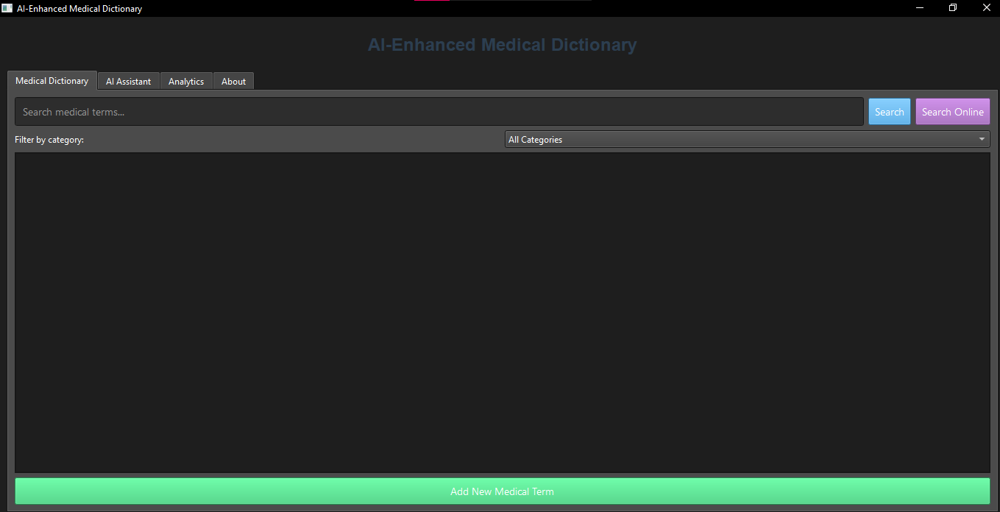

Here's a comprehensive `README.md` file for your Medical Dictionary Application:

```markdown
# Hospital AI Medical Dictionary



A comprehensive medical dictionary application designed for hospital use, featuring AI-powered term categorization, user management, and extensive medical term database.

## Features

- **User Authentication**:
  - Secure login system with password hashing
  - User registration with department assignment
  - Admin and regular user privileges

- **Medical Term Management**:
  - Add, edit, delete medical terms
  - Detailed term view with multiple information sections
  - Search and filter functionality

- **AI Integration**:
  - Automatic term categorization using machine learning
  - Body system prediction
  - Model training interface

- **Data Management**:
  - Import terms from CSV, Excel, PDF, and text files
  - SQLite database backend
  - Manage categories, body systems, and tags

- **Online Integration**:
  - Fetch definitions from Merriam-Webster medical dictionary
  - Web browser integration for viewing sources

## Installation

### Prerequisites

- Python 3.6+
- Required packages:
  ```
  pip install tkinter requests beautifulsoup4 pandas PyPDF2 scikit-learn joblib pillow
  ```

### Running the Application

1. Clone the repository or download the source files
2. Install dependencies:
   ```
   pip install -r requirements.txt
   ```
3. Run the application:
   ```
   python medical_dictionary.py
   ```

## Usage

### Default Credentials
- **Admin**: username `admin`, password `admin123`

### Basic Operations
1. **Login** with your credentials
2. **Search** for medical terms using the search bar
3. **Add new terms** through the Dictionary menu
4. **Import terms** from external files
5. **Use AI suggestions** for term categorization

### Admin Features
- Manage users, categories, body systems, and tags
- Train the AI model with existing terms
- View all terms in the dictionary

## Database Schema

The application uses SQLite with the following tables:
- `users` - User accounts and credentials
- `body_systems` - Medical body systems classification
- `categories` - Term categories
- `tags` - Term tags
- `dictionary` - Medical terms and definitions
- `term_tags` - Many-to-many relationship between terms and tags

## AI Model

The application uses a `MultinomialNB` classifier with `TfidfVectorizer` for term categorization. The model is trained on:
- Default medical knowledge (initial training)
- User-added terms (when manually trained)

Model files:
- `medical_category_model.joblib` - Trained classifier
- `medical_tfidf_vectorizer.joblib` - Vectorizer

## License

This project is licensed under the MIT License - see the [LICENSE](LICENSE) file for details.

## Contributing

Contributions are welcome! Please follow these steps:
1. Fork the repository
2. Create your feature branch (`git checkout -b feature/AmazingFeature`)
3. Commit your changes (`git commit -m 'Add some AmazingFeature'`)
4. Push to the branch (`git push origin feature/AmazingFeature`)
5. Open a Pull Request

## Screenshots

*(Add actual screenshots of the application here)*

## Support

For issues or questions, please open an issue on the GitHub repository.
```

### Additional Files You Should Create:

1. **requirements.txt**:
   ```
   requests>=2.26.0
   beautifulsoup4>=4.10.0
   pandas>=1.3.0
   PyPDF2>=1.27.0
   scikit-learn>=0.24.0
   joblib>=1.0.0
   pillow>=8.3.0
   ```

2. **LICENSE** (MIT License example):
   ```text
   MIT License

   Copyright (c) [2025] [Akrash Noor Awan]

   Permission is hereby granted...
   ```

### Repository Structure Recommendation:
```
/hospital-medical-dictionary
│   README.md
│   medical_dictionary.py
│   requirements.txt
│   LICENSE
│   screenshot.png
```

This README provides comprehensive documentation for your project, including installation instructions, features overview, usage guide, and contribution guidelines. You can customize it further by adding actual screenshots and adjusting the license information as needed.
